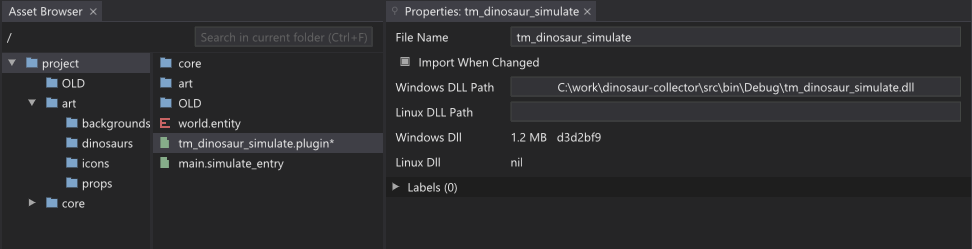

# Dino Dino!

Dino Dino! is a tiny dinosaur collecting game built in The Machinery.

To run it you need The Machinery 2021.1. Open a simulate tab to run the game.

This game, the code and the art are licensed under the [CC BY-NC
4.0](https://creativecommons.org/licenses/by-nc/4.0/) license.

You can find a game design spreadsheet with the rules of the game here:

* https://docs.google.com/spreadsheets/d/11sT_7U7IMrL_BpgIoLGul436z4L0lZe-oSCdbEn09DU/edit?usp=sharing

You can change the rules by changing the values in the spreadsheet and copying the C Code columns
into the source code.

To compile the source code, open the `src` directory in Visual Studio Code and run `Tasks: Run Build
Task`. (You need to set the `TM_SDK_DIR` environment variable to point to your The Machinery 2021.1
installation folder.)

You can set The Machinery up to automatically reload your code every time you build it. To do so,
select `tm_dinosaur_simulate.plugin` in the asset browser and click on the **Windows DLL Path**
object to point it to the location of your built `.dll`. Also make sure that **Import When Changed**
is selected:

